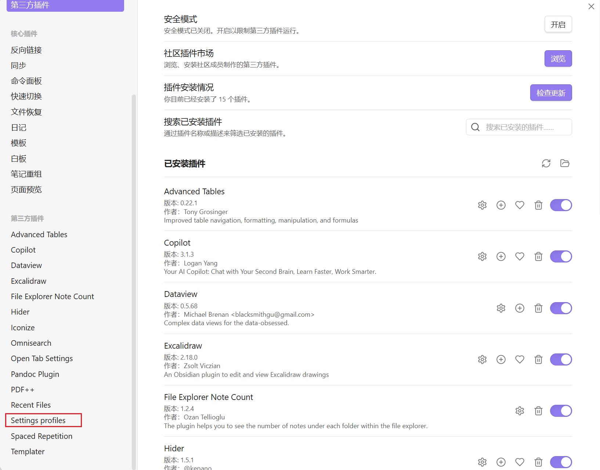

# Obsidian使用

## 1. 常用快捷键

| 功能                           | Windows / Linux  | 说明                 |
| ------------------------------ | ---------------- | -------------------- |
| 打开命令面板                   | Ctrl + P         | 搜全部命令/功能入口  |
| 打开图谱视图 Graph View        | Ctrl + G         | 全库关系图           |
| 快速切换笔记（Quick Switcher） | Ctrl + O         | 按名字搜索并打开笔记 |
| 在所有文件中搜索               | Ctrl + Shift + F | 全库全文搜索         |
| 在当前笔记中搜索               | Ctrl + F         | 当前文件内查找       |

## 2. 自定义快捷键

| 功能                       | Windows / Linux                                        |
| -------------------------- | ------------------------------------------------------ |
| 内部引用调用文件           | ctrl+alt+k                                             |
| 代码块                     | ctrl+shift+k                                           |
| 网址，内部超链接           | ctrl+k                                                 |
| 缩放图片像素级别           | ![[merge_linkedList.png\|500x0]]                       |
| 调用模板                   | ctrl+m / alt+e                                         |
| 上标$$中夹^                | $2^2$                                                  |
| 下标$$中夹_                | $H_2O$                                                 |
| 多个的用法$$夹着^{label}   | $Word^{label}$                                         |
| 多个的用法$$夹着_{label}   | $Word_{label}$                                         |
| 图片的用法                 |  |
| 插入附件                   | ctrl+shift+i                                           |
| 设置待办事项               | ctrl+L                                                 |
| 设置属性                   | ctrl+;                                                 |
| 插入表格                   | ctrl+t                                                 |
| icon                       | ctrl+shift+j                                           |
| 表格的格式                 | ctrl+shift+d                                           |
| 查看该文件哪些文件引入引出 | ctrl+shift+L                                           |

## 3. 如何快速配置obsidian

> 1. 设置快捷键
>
> 2. 配置相关三方插件
>
>    

==**注意这里存在一个快捷方法：复制所有的.obsidian文件夹下的文件和template目录下的文件和gitignore这三个文件**==

==**更快捷的方式就是下载一个叫做Setting profiles的一个第三方插件，然后修改插件的目录为：**==

```
D:\Program Files\Obsidian\Global

E:\Au_notes\Obsidian\Use
```

这里是我保存原配置的地方

其中gitignore中

```
.obsidian/workspace.json
.obsidian/workspace-mobile.json
```

下面我帮你分两层来解决：

1. **最简单、官方推荐的做法：复制 `.obsidian` 文件夹**（适合你现在就立刻用）
2. **更高级、真正“多库共享设置”的方案：用 Settings Profiles 插件做“全局设置档”**

------

### 一、先理解一下：为什么一换库就“什么都不见了”

- 每个库的根目录下面都有一个隐藏文件夹：`/.obsidian`
  - 里面存着：
    - 主题 & 外观设置
    - 快捷键
    - 哪些 core / community 插件启用、插件设置
    - Templater、Dataview 等插件的配置（包括模板目录路径）
- 你一换到另一个库，就换了一套 **完全独立的 `.obsidian`**，所以：
  - 快捷键是默认的
  - 社区插件列表是空的
  - Templater 配置的模板目录也没有了

官方文档对“多库 + 迁移设置”的建议就是：

> 想让另一个库用同一套设置 → 就把 `.obsidian` 文件夹整个复制过去。

------

### 二、最简单实用的方法：把一个“模板库”的设置复制给所有新库

#### 1. 选一个“主库 / 模板库”

挑一个你已经配置好一切的库，比如：

- 装好了你要的 Dataview、Templater、Excalidraw 等插件
- 快捷键也设得很舒服
- 模板、CSS snippet 等都 OK

以后所有新的库，都以它为“模版”。

------

#### 2. 找到并复制这个库的 `.obsidian` 文件夹

以 Windows 为例（你现在就是 Windows）：

1. 在资源管理器中打开你的“主库”文件夹；
2. 点击上方菜单：**“查看 → 显示 → 隐藏的项目”**（把隐藏文件显示出来）；
3. 你会看到库的根目录下多了一个文件夹：
   - `.obsidian`
4. 把整个 `.obsidian` 文件夹 **复制** 出来（右键复制）。

> 这个 `.obsidian` 里就包含了你说的所有东西：快捷键、插件列表、模板插件设置……

------

#### 3. 给“新库”套用这套配置

创建一个新库后：

1. 先关掉这个库（或者直接退出 Obsidian，更保险）；
2. 在资源管理器打开新库的根目录；
3. 如果里面已经有一个 `.obsidian` 文件夹：
   - 可以先改名成比如 `.obsidian-backup`（留个备份），
   - 然后把刚才复制的 `.obsidian` 粘贴进来；
4. 重开这个库 / 重启 Obsidian。

现在这个新库里：

- 快捷键 = 跟主库一模一样
- 插件 + 插件设置 = 跟主库一模一样
- Templater 等插件的设置也都同步了

> 官方帮助文档里的“Transfer settings to another vault”讲的就是这一步。

------

#### 4. 模板（Templates）本身怎么办？

**注意：**
 Templater / Templates 插件里的“模板目录设置”会被 `.obsidian` 带过去，
 但是**模板文件本身**还是普通 `.md`，放在库里的某个文件夹里。

所以要保证每个库都能用到同样的模板，有两个方案：

1. **简单粗暴：每新建一个库就一起复制模板文件夹**
   - 比如主库里有 `Templates/` 文件夹
   - 新库建好后，把整个 `Templates` 文件夹也复制过去
2. **进阶一点：在多个库里用同一个“模板仓库”做软链接（symlink）**
   - 比如在 D 盘建一个 `D:\Obsidian-Common-Templates`
   - 然后在每个库里建立一个指向它的软链接 `Templates`
   - Obsidian 支持把软链接当成普通文件夹使用（注意不要对 `.obsidian` 做 symlink，官方不太推荐）。

对你来说，目前**复制 `Templates` 文件夹**已经够用了，软链接可以以后再慢慢折腾。

------

### 三、想要更自动化一点：用「Settings Profiles」插件同步所有库的设置（推荐）

如果你会经常新建库，又懒得每次手动复制 `.obsidian`，
 可以考虑装一个专门做“全局设置档”的插件：

> 插件名：**Settings Profiles**（settings-profiles-obsidian-plugin）
>  作用：在一个“全局位置”保存设置档，让多个库共用同一份设置。

#### 1. 安装这个插件

在**每个想要共享设置的库**里都要安装一次：

1. 打开该库 → `设置 → 社区插件 → 浏览（Browse）`
2. 搜索：**Settings Profiles**
3. 安装并启用。

（插件 README 里说明它会把设置档存在一个“全局路径”下，供多个库共享。）

------

#### 2. 在“主库”里创建一个配置档 Profile

在你已经配置好的一套主库里：

1. 打开 `设置 → Settings Profiles`（插件设置页）；
2. 选择“Add new Profile”（新增配置档）；
3. 给这个 profile 起个名字，比如：`MyGlobalConfig`；
4. 选择你想同步的内容：
   - Appearance（主题、CSS snippet）
   - App（编辑器、文件/链接设置）
   - Hotkeys（快捷键）
   - Community plugins（插件 & 插件设置）
   - Core plugins 等等
5. 保存。你现在相当于“冻结”了一份全局的设置快照。

------

#### 3. 在其它库里应用同一个配置档

在你想同步的新库里：

1. 同样安装并开启 **Settings Profiles** 插件；
2. 打开插件设置，确认 **Profile save path**（配置保存路径）跟主库的是同一个地方（默认其实就是一个全局目录，一般不用改）；
3. 插件会自动识别到你之前建的 `MyGlobalConfig` profile；
4. 点击“Switch to Profile / Load profile”之类的按钮，让当前库使用这个配置档；
5. Obsidian 会提示需要 reload，重启后：
   - 这个库的快捷键、主题、插件、插件设置，都会和主库保持一致。

以后你在某一个库里改了设置，如果开启了这个插件的 **Auto-Sync**，它会自动更新到这个 profile，其他库下次切换/重载时都会用到最新的设置。

------

### 四、顺带提一个思路：如果不是真正必须，多用“一个大库 + 多文件夹”

因为：

- **一个库 = 一套设置、插件、模板**
- 多个库 = 多套配置要维护，容易乱

如果你只是想把内容分门别类（学习 / 工作 / 股票 / 生活），
 其实完全可以在一个大库里用：

- 顶层文件夹：`Study/`, `Work/`, `Diary/` …
- 标签：`#ML`, `#PDC`, `#LeetCode` …

这样：

- 所有快捷键、插件、模板、Dataview 表格、Templater 模板都只要维护一套
- 你现在已经花很多时间调好的模板/快捷键也不用反复迁移

------

### 五、你现在可以怎么做（实用小总结）

1. **先选一个“主库”**：把你最喜欢的插件 + 快捷键 + 模板都整理好；
2. 以后每建一个新库：
   - 直接复制这个主库的 `.obsidian` 到新库根目录；
   - 必要时再把 `Templates` 文件夹也一起复制过去。
3. 如果你觉得将来会很多库、经常调设置：
   - 可以再加装 **Settings Profiles** 插件，把配置变成真正的“全局档案”，新库装上插件后，一键切换到这份 profile 就完事了。


## 4. git工作方式

这个现象其实**完全正常**，不是 `.gitignore` 写错了，而是 **Git 的工作方式决定的**：

> `.gitignore 只对「未被跟踪的文件（untracked）」起作用，   一旦某个文件已经被 `git add` 过并进入版本库（tracked），`.gitignore` 就管不住它了。

你截图里右上角红框里的 `.obsidian/workspace.json` 是 **已经被 Git 跟踪过的文件**，所以：

- 即使你在 `.gitignore` 里写了

  ```
  .obsidian/
  .obsidian/workspace.json
  .obsidian/workspace-mobile.json
  copilot/
  ```

- Git 仍然会继续跟踪它的修改，并且允许你 **stage** 这些变化。

------

### 一、为什么 `.gitignore` 不生效？

看你截图右上角的 panel：

- `Unstaged Files (2)` 下面有：
  - `.gitignore`（刚被你修改）
  - `.obsidian/workspace.json`

这说明：

1. `.obsidian/workspace.json` 以前你已经 `git add` + `commit` 过了；
2. 现在你在 Obsidian 里动了布局，它被改了，Git 认为是 **“已跟踪文件的修改”**；
3. 对于 **已经跟踪的文件**，`.gitignore` 不会阻止它继续出现在 changes 里，也不会阻止你 stage/commit。

`.gitignore` 的逻辑可以理解成：

- **新出现的文件**：
  - 若匹配 `.gitignore` → 在 `git status` 里不会显示（除非 `-f` 强行添加）；
  - 若不匹配 → 正常显示，可被 `git add`。
- **已经被跟踪的文件**：
  - 不管 `.gitignore` 里写不写，它 **都会继续被跟踪**，修改会出现在 `git status` 里。

所以你现在看到的情况完全符合规则。

------

### 二、如果你想「以后都不要再跟踪 .obsidian/workspace.json」

#### 1. 正确写法（选择你想要的粒度）

- 如果你想**整个 .obsidian 目录都不跟踪**（不把 Obsidian 配置放进 Git）：

  ```
  .obsidian/
  ```

- 如果你想**只忽略 layout 这几个文件，保留插件配置等其它内容**（更常见）：

  ```
  .obsidian/workspace.json
  .obsidian/workspace-mobile.json
  ```

> 现在你的 `.gitignore` 里有一行 `.obsidian`，
>  这会把整个 `.obsidian` 目录都忽略掉（包括插件配置），
>  如果你想用 Git 同步 Obsidian 的设置，建议删掉这一行，只保留 workspace 那两行。

⚠️ 但无论你写哪种，**下一步都必须把已经被跟踪的文件“从版本库里移除追踪”**，否则 `.gitignore` 还是不会生效。

------

#### 2. 用命令取消跟踪（不删本地文件，只是不再纳入版本控制）

在仓库根目录打开终端（你截图下面那个 PowerShell 就可以），根据你的需求二选一：

##### 方案 A：取消整个 `.obsidian` 目录的跟踪

```
git rm -r --cached .obsidian
git commit -m "Stop tracking Obsidian config"
```

- `--cached`：只从 Git 的索引里删除，不会删硬盘上的实际文件。
- 下次 `git status` 时就看不到 `.obsidian/...` 的修改了。

##### 方案 B：只取消 `workspace.json` 这些文件的跟踪

```
git rm --cached .obsidian/workspace.json
git rm --cached .obsidian/workspace-mobile.json
git commit -m "Ignore Obsidian workspace layout files"
```

然后 `.gitignore` 保留：

```
.obsidian/workspace.json
.obsidian/workspace-mobile.json
```

之后你再改 Obsidian 的窗口布局，这两个文件就不会出现在 changes 里了。

------

### 三、顺带帮你总结一下区别

- `.gitignore`：
  - 只对 **没被 add 过的新文件** 起作用；
  - 已经提交进仓库的文件，不会自动“消失”。
- 要让某个文件以后完全被忽略，流程应该是：
  1. 在 `.gitignore` 写好规则；
  2. `git rm --cached 路径` 把它从版本控制中移除；
  3. `git commit` 一下这次变更。

以后它就是“普通本地文件 + 不受 Git 管”的状态了。